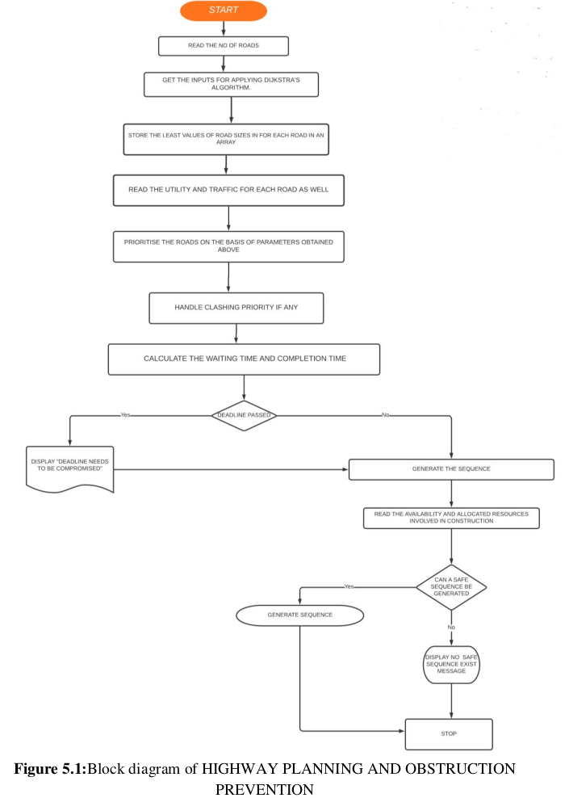

# Road Construction Using Highway Planning and Obstruction Prevention

### Table Of Contents

-  Abstract
-  Block Diagram
-  Pseudo Code
-  Output Screenshot


### 1. Abstract

The project titled ROAD CONSTRUCTION USING HIGHWAY PLANNING AND
OBSTRUCTION PREVENTION aims to address one of the major issues that the Indian
road construction department is facing. These days we notice that a large number of roads
are not in proper condition and many of them require restoration. Many of which are in
high usage and require immediate repair. Our project aims to help authorities with
providing them the most profitable path for road construction for a given map and the
sequence in which these roads can be addressed so that it would be convenient for both
the authorities as well as the general public. Our project collects various forms regarding
the map for the road that needs to be constructed, with this data we find the most shortest
and profitable path possible . Then we collect data for utility and traffic for all the roads
,then we normalize the data collected and generate a appropriate sequence in which the
road construction should be addressed. We have also included a deadline section so that
the roads that take more then the allocated time are highlighted and if necessary removed.
Also, a check for hindrance detection is added which can be used when we have limited
number of resources and a proper allocation of these resources is required. For this we
take inputs for resources which can refer to asphalt, machinery, mortar etc. Then we
require maximum resources needed for each road, amount of resources allotted for each
road, and available resources, based on which a safe sequence is generated that prevents
any unwanted stoppage of work.

### 2. Block Diagram



Explanation:

1) First we take inputs for the number of roads
2) Then we will take inputs for the formation of map in form of graph for all the different
roads
3) Then based on the graph we will apply Dijkstra algorithm and find the shortest distance
possible between the desired cities
4) This distance is saved as a parameter of size for the roads
5) Also the route of the shortest path will be displayed
6) Then we read the utility, traffic and deadline for all the roads
7) Based on these inputs we check for clashing between the priorities
8) If present the clashing is handled
9) Then the required sequence is generated
10) Based on the sequence we find the waiting and completion times for the roads
11) Now we check if the roads can be completed within their allocated time
12) If deadline is crossed then an error message “DEADLINE NEEDS TO BE
COMPROMISED IS DISPLAYED”
13) If dead line is not passed the generated sequence is displayed and we move to the second
part of project
14) Here we read the number of resources needed for each road,maximum resources needed
for each road, amount of resources allotted for each road, and available resources
15) Based on which a safe sequence is generated
16) If sequence is not generated then an error message is displayed


### 3. Pseudo Code

PSEUDO CODE FOR DIJAKSTRA FOR FINDING SHORTEST PATH FOR ROADS ->
INPUTS AND ALGORITHM ->

1- FIRSTLY, WE WILL TAKE THE INPUT FOR THE FORMATION OF MAP FOR
DIJAKSTRA

2- THIS INVOLVES TAKING THE INPUT FOR NUMBER OF CITIES(NODES);
NUMBER OF ROUTES CONNECTING THEM(EDGES); AND THE DISTANCE
OF THE ROUTES(WEIGHT OF EDGES)

3- THEN WE APPLY THE DIJAKSTRA ALGORITHM FOR THE MAP(GRAPH)
AS FOLLOWS

```
function Dijkstra(Graph, source)

       dist[source] := 0                              // Distance from source to source is set to 0
       
       for each vertex v in Graph:                    // Initializations
       
       if v ≠ source
             dist[v] := infinity                          // Unknown distance function from source to each node                                                                 set to infinity
        add v to Q                                     // All nodes initially in Q
        
        while Q is not empty:                          // The main loop
              v := vertex in Q with min dist[v]              // In the first run-through,this vertex is the source                                                                 node
              remove v from Q
        
        for each neighbor u of v:                      // where neighbor u has not yet been removed
                                                          from Q.
              alt := dist[v] + length(v, u)
              if alt < dist[u]:                              // A shorter path to u has been found
                    dist[u] := alt                                 // Update distance of u

return dist[]
```

4- THEN FROM THE OBTAINED DISTANCE ARRAY WE FIND THE
DESTIANTION VERTEX

5- THE DISTANCE IS THEN SAVED AS SIZE FOR THE ROAD

PSEUDO CODE FOR PRIORITY SCHEDULING FOR SCHEDULING THE ROADS
INPUTS AND ALGORITHM ->

1- FIRSTLY, WE TAKE THE INPUT FOR THE NO OF ROADS.

2- NOW HERE WE ASSIGN THE PRIORITIES FOR EACH ROAD BASED ON A
NO OF PARAMETERS NAMELY SIZE, UTILITY, TRAFFIC.

3- NOW FOR SIZE WE EMPLOY DIJKSTRA’S ALGORITHM FOR GETTING THE
LEAST POSSIBLE PATH FOR THE CONSTRUCTION OF OUR ROAD.

4- FIRST, WE GENERATE A SEQUENCE IN WHICH THE CONSTRUCTION
WORK SHOULD PROCEED. THIS SEQUENCE IS GENERATED ON THE
BASIS OF PRIORITY SCHEDULING ALGORITHM. SO, IN THIS ALGORITHM
WE USE THE ABOVE PARAMETERS AND SUM THEM UP AND NORMALISE
THEM DOWN TO 1-100 TO GET THE PRIORITY FOR ANY CONSTRUCTION
PROJRCT.

5- Which is done by using:

Priority Pi of road i = (Si / Sigma(Si)) *100

Where Si for any given road i is submission of size, utility and traffic

6- PRIORITY SCHEDULING WITHOUT PREEMPTION IS APPLIED AS
FOLLOWS

```
function Priority Scheduling(Processes,Priority,Arrival_Time,Burst_Time)
        
        Current_Time := 0                                //Current Time of the CPU
        
        while (All Processes are not executed):
               
               P:=All the processes whose Arrival_Time=<Current_Time
               
               i := index of the process with highest Priority in P
               
               If(No index is found)                      //CPU in ideal state , no process arrived yet
               
               Current_Time++
        
        Else
               
               Execute the process P[i]
               
               Current_Time=Current_Time+Burst_Time[i]
               
               Completion_Time[i] = Current_Time
               
               Turnaround_Time[i] =Completion_Time[i] - Arrival_Time[i]
               
               waiting_time[i] = turnaround_time[i]- burst_time[i]
               
               response_time[i] = start_time[i] - arrival_time[i]

```

7- ALSO FOR THE ABOVE CASE IF A SCENARIO OCCURS WHERE THE
PRIORITIES OF TWO ROAD CLASHES THEN FIRST WE GO FOR THE
UTILITY OF THE ROADS TO DECIDE THE PRIORITY THEN TRAFFIC AND
THEN SIZE.

8- SO ONCE WE HAVE GIVEN ALL THE REQUIRED INPUTS FOR
PARAMETERS , WE WILL ALSO BE ASKING THE USER TO ENTER THE
DEADLINE AS WELL AS THE EXPECTED COMPLETION TIME.
OUTPUTS OBTAINED ->

9- SO, AFTER SUCCESSFUL EXECUTION WE WILL BE GETTING THE
WAITING TIME AS WELL AS THE TOTAL TIME CORRESPONDING TO
EACH OF THE CONSTRUCTION PROCESSES.

10- IN ADDITION TO THAT WE WILL BE GETTING THE TURNAROUND TIMES
FOR EACH CONSTRUCTION AS WELL.

PSEUDO CODE FOR BANKERS ALGORITHM ->

1- SO, THIS ALGORITHM IS USED TO GIVE A SAFE SEQUENCE FOR THE
CONTINUATION OF CONSTRUCTION PROCESSES AT ALL TIMES.

2- WE TAKE THE INPUT OF
   - NO OF RESOURCES THAT ARE REQUIRED FOR THE CONSTRUCTION
     OF THE ROAD
   - THE ALLOCATION OF THESE RESOURCES THAT THE CONSTRUCTION
     AUTHORITY HAS DONE.
   - THE MAXIMUM RESOURCES THAT A PARTICULAR ROAD WILL
     REQUIRE AT ANY STAGE IN THE CONSTRUCTION PROCESS.
   - AND LASTLY THE AVAILABILITY OF THESE RESOURCES WITH THE
     CONSTRUCTION RESOURCES CURRENTLY.

3- AFTER ALL THESE INPUTS THE STANDARD NEED MATRIX OF THE
BANKERS ALGORITHM IS CALCULATED.

4- NOW FOR EACH PROJECT WE COMPARE WHETHER THE ALLOCATION IS
GREATER OR EQUAL TO THE NEED ARRAY FIGURES FOR THE
FOLLOWING PROJECT IN CASE SUCH A PROJECT IS FOUND WE PROCESS
IT AND THEN TAKES BACK THE ALLOCATED RESOURCES FROM THAT
PARTICULAR PROJECT AND GIVES IT TO THE AVAILABLE ARRAY .

5- THE SAME PROCESS IS REPEATED UNTILL WE DON’T SATISFY THE NEED
OF EACH PROJECT.

6- IN CASE WE FAIL TO FIND A PROCESS AT ANY PARTICULAR STAGE
SUCH THAT THE NEED OF NO PROCESS IS SATISFIED BY THE
AVAILABLE MATRIX WE PRINT “ NO SAFE SEQUENCE FOR
CONSTRUCTION WITH THE AVAILABLE NO OF RESOURCES”.

7- OTHER WISE WE PRINT THE SEQUENCE WHICH NEEDS TO BE FOLLOWED
FOR SAFE COMPLETION OF ALL PROJECTS.


### 4. Output Screenshots

OUTPUT-1 (Deadline compromised,Clash of priority,Safe sequence exists)

.png)

.png)

.png)

.png)

.png)

OUTPUT-2 (No Deadline issue, No Clash of priority,Safe sequence does not exist)

.png)

.png)

.png)

.png)
